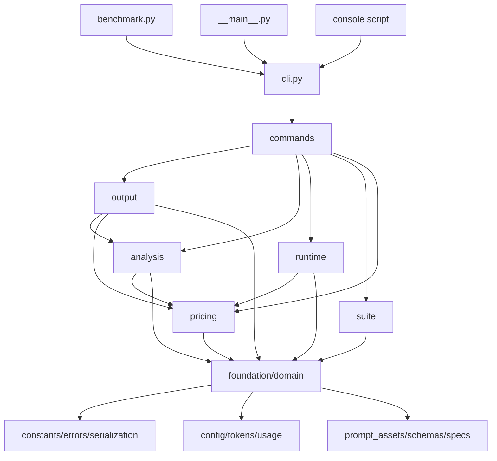
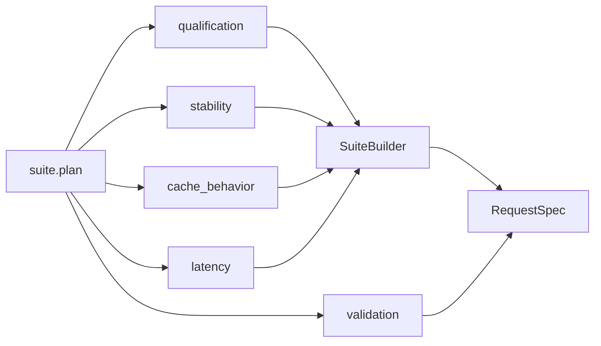
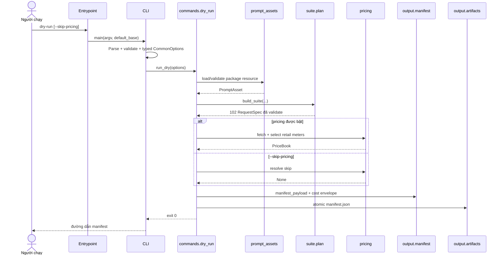
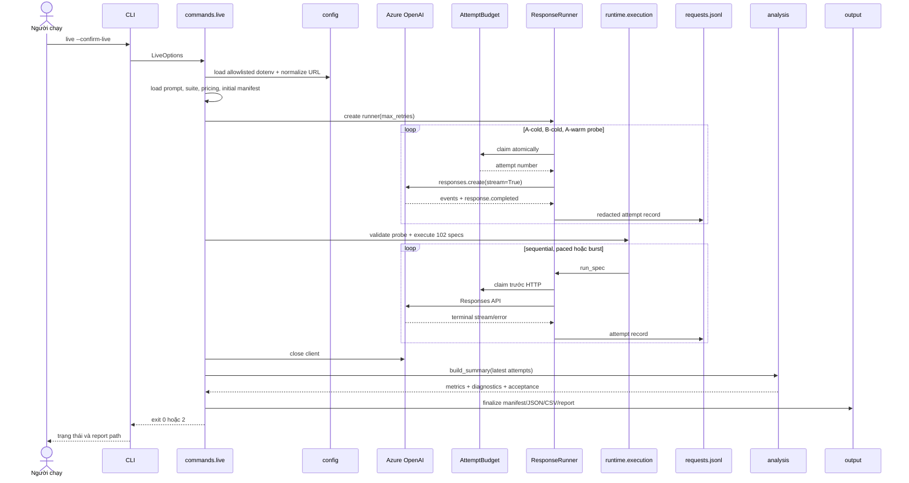

# Kiến trúc Azure OpenAI Cache Benchmark

Tài liệu này là bản đồ ownership và dependency của package, dành cho người bảo trì mã nguồn. Khách hàng chạy benchmark không cần đọc tệp này.

## Nguyên tắc

- Mã production nằm trong `src/azure_openai_cache_benchmark/`; `benchmark.py` chỉ là launcher tương thích.
- Dependency chỉ đi từ layer cao xuống layer thấp. Không có import ngược hoặc chu trình.
- Mỗi tệp Python production có tối đa 300 dòng vật lý.
- `argparse.Namespace` chỉ tồn tại trong `cli.py`; command nhận dataclass có kiểu.
- `SuiteBuilder` sở hữu danh sách, order và append state. Experiment chỉ thêm spec, không import composition.
- Validation suite không import `suite.plan`.
- Network lookup giá chỉ nằm trong `pricing.retail`; `pricing.costs` là phép tính thuần.
- Usage parsing và cache predicates nằm dưới runtime lẫn analysis.
- Manifest và sanitizer là hai boundary riêng.
- Không có wildcard re-export hoặc flat compatibility API.

## Dependency giữa các layer

Chi tiết bên trong suite:

## Ownership module

| Module | Ownership |
| --- | --- |
| `__init__.py` | Version package; không re-export API domain. |
| `__main__.py` | Entrypoint `python -m`; dùng base là `Path.cwd()`. |
| `cli.py` | Parser, validation flag, chuyển `Namespace` sang typed options và dispatch. |
| `constants.py` | Hằng số benchmark, threshold, allocation, URL tài liệu và logical prompt path. |
| `errors.py` | Exception hierarchy dùng chung. |
| `serialization.py` | UTC timestamp, canonical JSON, SHA-256, short hash, safe slug và word count. |
| `config.py` | Dotenv allowlist, URL normalization, endpoint fingerprint và redaction text. |
| `tokens.py` | Chọn encoding, ước tính và truncate token. |
| `prompt_assets.py` | Đọc prompt bằng `importlib.resources`, validate marker và render dynamic tail. |
| `schemas.py` | Structured-output schema và canonical tool definitions. |
| `specs.py` | `RequestSpec`, request fingerprint, manifest row, cache key và input mặc định. |
| `usage.py` | Terminal usage parsing, prefix efficiency và cache-state predicates. |
| `suite.builder` | Append contract, order, logical ID và token estimate tập trung. |
| `suite.qualification` | Qualification arms và capability/isolation probe. |
| `suite.stability` | Prefix-stability và tool/schema-stability experiments. |
| `suite.cache_behavior` | Cache-key cardinality, traffic shape và idle retention. |
| `suite.latency` | Mười matched cold/warm pairs. |
| `suite.validation` | Allocation, order, optimized cohort và pair invariants; không biết composition. |
| `suite.plan` | Composition order duy nhất của 102 planned requests. |
| `pricing.models` | `PriceBook` và typed `PricingOptions`. |
| `pricing.retail` | Azure Retail Prices HTTP pagination, meter selection và CLI override resolution. |
| `pricing.costs` | Cost formulas và hard-cap-aware expected envelope; không network. |
| `runtime.budget` | Atomic claim ledger và hard cap. |
| `runtime.events` | Stream error types, event/response conversion, error metadata và recursive redaction. |
| `runtime.streaming` | Một HTTP attempt: claim, stream consumption, terminal usage, timing và record. |
| `runtime.runner` | Retry policy, same-arm gap state, record storage và writer protocol. |
| `runtime.execution` | Sequential/burst execution cùng probe và under-threshold validation. |
| `analysis.metrics` | Latest-attempt selection, percentile và aggregate metric. |
| `analysis.diagnostics` | Root-cause A/B và matched-latency diagnostics. |
| `analysis.summary` | Acceptance, cohort aggregation và deterministic summary. |
| `output.artifacts` | Atomic text/JSON, JSONL writer/reader và summary CSV. |
| `output.manifest` | Manifest schema và request-plan hashes; không sanitizer. |
| `output.sanitizer` | Explicit allowlist cho committed sample; không manifest logic. |
| `output.report_sections` | Format và table fragments cho report. |
| `output.report` | Markdown renderer tiếng Việt. |
| `commands.context` | Typed command options, run ID/directory và prompt/suite context. |
| `commands.dry_run` | Dry-run orchestration, pricing snapshot, envelope và manifest. |
| `commands.live` | Live guard, env/client setup, probe, execution và artifact finalization. |
| `commands.reports` | Offline rebuild và sanitized sample generation. |
| `prompts/…md` | Package resource bất biến dùng cho benchmark. |
| `benchmark.py` | Launcher CLI-only; truyền repository root làm default base. |

Các `__init__.py` của subpackage chỉ đánh dấu boundary, không wildcard re-export.

## Sequence dry-run

Dry-run không gọi Azure OpenAI. Với `--skip-pricing`, nó cũng không gọi Azure Retail Prices.

## Sequence live

SDK internal retry luôn tắt. Mỗi retry do runner quản lý phải claim cùng `AttemptBudget`; matched pairs và burst members không retry.

## Path policy của entrypoint

| Entrypoint | Default base |
| --- | --- |
| `python benchmark.py` | Thư mục chứa launcher/repository. |
| `python -m azure_openai_cache_benchmark` | Thư mục làm việc hiện tại. |
| `azure-openai-cache-benchmark` | Thư mục làm việc hiện tại. |

Flag đường dẫn luôn ghi đè default. Prompt mặc định không phụ thuộc filesystem base vì được đọc từ package resource; logical path và SHA-256 vẫn ổn định.

## Quality gates

`tests/test_architecture.py`:

1. đếm dòng của `benchmark.py` và mọi `src/**/*.py`;
2. resolve import nội bộ bằng AST và đối chiếu explicit layer map;
3. chặn import ngược, module chưa map, cycle và wildcard import;
4. chặn `argparse.Namespace` bên ngoài CLI;
5. xác nhận metadata đóng gói, bỏ `benchmark_core.py` và bỏ URL alias cũ.

Các test khác khóa prompt hash, suite/probe hash, ba entrypoint, CWD/repository policy, sample-render parity, retry/budget và artifact semantics.
