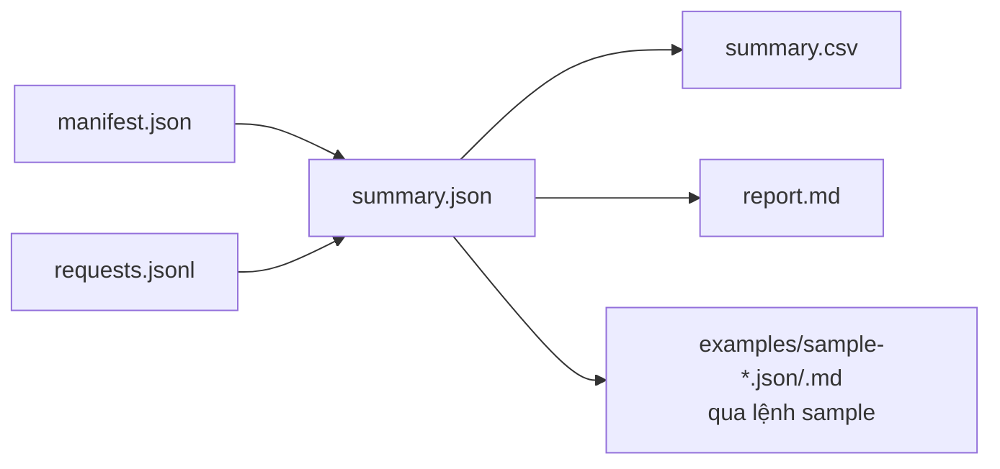
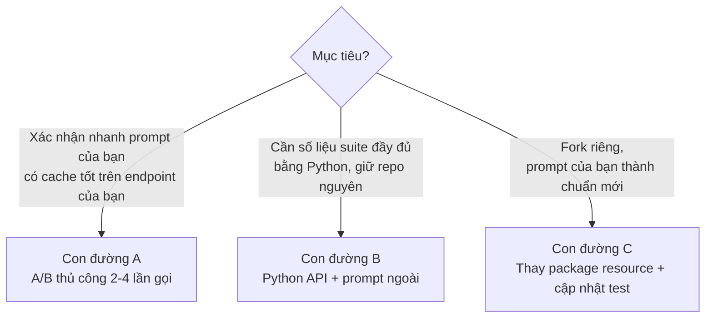

# Sổ tay vận hành benchmark

Tài liệu tham chiếu cho người vận hành và cho hệ thống agent. Bốn phần:

- **Phần A** — cách đọc báo cáo và toàn bộ tệp kết quả;
- **Phần B** — quy trình từng bước chạy benchmark trên endpoint của bạn;
- **Phần C** — ba con đường test với system prompt riêng của bạn;
- **Phần D** — checklist cải thiện cache efficiency cho hệ thống agent.

Thuật ngữ kỹ thuật được giải thích tại chỗ khi xuất hiện lần đầu. Cơ chế đo và
khuyến nghị triển khai chi tiết nằm trong [`GUIDE_VI.md`](../GUIDE_VI.md);
tài liệu này tập trung vào vận hành: đọc gì, gõ lệnh gì, sửa gì.

---

## Phần A. Cách đọc báo cáo

### A.0 Báo cáo mang lại gì cho bạn

Một lần chạy trả lời bốn câu hỏi thực dụng. Cột "Ví dụ" lấy từ run mẫu thật
[`examples/sample-report.md`](../examples/sample-report.md):

| Câu hỏi | Nhìn vào đâu trong report | Ví dụ từ run mẫu |
| --- | --- | --- |
| Endpoint có cache thật không? | Dòng Optimized, cột Substantive hit rate | 44/44 yêu cầu trúng cache có ý nghĩa (100%) |
| Tiết kiệm bao nhiêu tiền? | Cột Input savings / Total savings và mục Cost | Input −87.1%, tổng −80.6%; cả run tốn $0.392658 thay vì $0.675877 nếu không cache |
| Nếu kém thì vì cái gì? | Bảng Degraded diagnostic và root-cause deltas | Cache key sai làm mất 98 điểm token-weighted; prefix bất ổn mất 92 điểm |
| Cache có nhanh hơn không? | Mục Pair isolation matched latency | Run mẫu: warm **không** nhanh hơn cold (+482ms) — report không kết luận latency benefit khi số đo không ủng hộ |

**Quy đổi mức tiết kiệm sang hệ thống của bạn.** Lấy `Token-weighted cache
rate` của nhóm Optimized và bảng Pricing trong chính report. Với giá mẫu,
token cache được tính $0.075/1M thay vì $0.75/1M — rẻ hơn 90% — nên:

```text
tiết kiệm input ≈ token-weighted rate × (1 − giá cached/giá uncached)
ví dụ run mẫu:   96.8% × 90% ≈ 87.1%  (khớp cột Input savings)
```

Phần output không bao giờ được cache, vì vậy hệ thống sinh câu trả lời dài sẽ
thấy Total savings thấp hơn Input savings đáng kể — đó là hành vi đúng, không
phải lỗi đo. Benefit chắc chắn của prompt cache là **chi phí**; còn latency
phải đọc từ số đo cặp matched, không được suy diễn.

### A.1 Bộ tệp kết quả và quan hệ giữa chúng

Mỗi lần chạy tạo một thư mục `runs/<run-id>/`. Run ID sinh tự động theo dạng
`live-YYYYMMDDTHHMMSSZ-xxxxxxxx` (hoặc `dry-...`), hoặc do bạn đặt qua
`--run-id` (chỉ gồm chữ, số, gạch dưới, gạch nối).

| Tệp | Loại | Nội dung |
| --- | --- | --- |
| `manifest.json` | Raw (gốc) | Kế hoạch chạy: model, hash prompt, phân bổ kịch bản, ảnh chụp giá, fingerprint endpoint, trạng thái thực thi. Ghi ngay khi bắt đầu. |
| `requests.jsonl` | Raw (gốc) | Mỗi dòng một lần gọi HTTP thật, gồm usage, timing, lỗi đã che dữ liệu nhạy cảm. Chỉ có ở chế độ live. |
| `summary.json` | Derived (dẫn xuất) | Chỉ số tổng hợp theo schema `2.0.0`. |
| `summary.csv` | Derived | Bảng một dòng mỗi experiment/arm, mở được bằng spreadsheet. |
| `report.md` | Derived | Báo cáo tiếng Việt đọc được ngay. |



Nguyên tắc quan trọng: **hai tệp raw là nguồn sự thật duy nhất**. Ba tệp derived
rebuild được bất kỳ lúc nào bằng lệnh `report` (mục B.6) mà không gọi model hay
API giá. Nếu nghi ngờ báo cáo, rebuild rồi so sánh.

### A.2 Đọc `report.md` theo từng mục

Xem mẫu thật đã khử nhạy cảm tại
[`examples/sample-report.md`](../examples/sample-report.md).

**Dòng mở đầu** cho ba thông tin quyết định:

```text
Run `live-general-20260714T1148Z` dùng model `gpt-5.4-mini`.
Trạng thái run: `completed`. Acceptance cache-only: **pass**.
```

- `Trạng thái run` (`run_status`): `completed` = mọi yêu cầu hoàn tất;
  `completed_with_findings` = chạy xong nhưng có yêu cầu thất bại chung cuộc
  (final failure — thất bại sau khi đã hết lượt retry); `incomplete` = run bị
  cắt giữa chừng (lỗi fatal, hết budget, hoặc operator bấm Ctrl-C).
- `Acceptance` (kết quả nghiệm thu): `pass` / `fail` / `incomplete`. Chỉ tính
  trên nhóm optimized (mục A.6), không phải toàn bộ run.

**Bảng "Kết quả chính"** có ba dòng — đọc đúng phạm vi từng dòng:

| Phạm vi | Gồm những gì | Dùng để làm gì |
| --- | --- | --- |
| Overall | Toàn bộ 105 yêu cầu chung cuộc: 102 planned + 3 probe, kể cả cold seeds và các arm cố ý phá cache | Nhìn tổng thể chi phí/khối lượng. **Không** dùng làm KPI cache. |
| Optimized | Đúng 44 yêu cầu warm mô phỏng production đã cấu hình đúng | **Đây là con số đại diện cho hệ thống làm đúng.** Acceptance tính trên nhóm này. |
| Degraded diagnostic | Các arm cố ý gây bất ổn (prefix xáo trộn, tool đảo thứ tự, key per-request, burst) | Bằng chứng nguyên nhân, không phải KPI. |

Ý nghĩa từng cột:

- `Logical requests` — số yêu cầu logic (một yêu cầu có thể có nhiều HTTP
  attempt do retry; ở đây đếm theo yêu cầu, không theo attempt).
- `Completed` — số yêu cầu có kết quả terminal thành công.
- `Substantive hit rate` — tỷ lệ yêu cầu trúng cache "có ý nghĩa": terminal
  `cached_tokens >= 1024` **và** đạt tối thiểu 80% phần prefix có thể cache.
  Khác với request hit rate thường (chỉ cần `cached_tokens > 0`).
- `Token-weighted cache rate` — `sum(cached_tokens) / sum(input_tokens)`.
  Đây là chỉ số phản ánh tiền, vì tiền tính theo token chứ không theo request.
- `Input savings` — tiết kiệm trên chi phí input so với kịch bản không cache.
- `Total savings` — tiết kiệm trên tổng chi phí (input + output). Luôn thấp hơn
  input savings vì output không được cache và giá output cao.

**Mục "Pair isolation cho matched latency"** — đo độ trễ theo cặp cold/warm:

- `Valid pairs: 10/10` — số cặp đạt chuẩn so sánh (cold thật sự miss, warm
  thật sự substantive hit, không retry, đủ số liệu thời gian).
- `median warm-minus-cold TTLT` — trung vị hiệu (warm − cold) của TTLT
  (time-to-last-token, tổng thời gian stream). Giá trị **dương** nghĩa là warm
  chậm hơn cold trong mẫu này.
- `causal_latency_claimed=false` — benchmark từ chối tuyên bố quan hệ nhân quả
  về latency: tải server, routing và số token sinh ra là nhiễu chưa kiểm soát.
  Latency ở đây chỉ mang tính định hướng (directional). **Không** dùng con số
  này để cam kết "cache nhanh hơn X ms".

**Mục "Pricing và cost guard"** — ba đơn giá theo USD/1M token (uncached input,
cached input, output), nguồn và thời điểm lấy giá, chi phí thực tế và chi phí
so sánh không cache. Khi chạy `--skip-pricing`, mọi ô tiền là `n/a` — báo cáo
không bao giờ đổi "không biết giá" thành "0 đồng".

**Mục "Pass thresholds"** — xem A.6.

**Mục "Root-cause evidence"** — bảng bốn factor với token-weighted cache rate
hai phía và delta:

| Factor | Nghĩa |
| --- | --- |
| `prefix_volatility` | Phần đầu prompt thay đổi mỗi yêu cầu |
| `tool_schema_churn` | Thứ tự/nội dung khai báo tool không ổn định |
| `cache_key_cardinality` | Mỗi yêu cầu một `prompt_cache_key` riêng |
| `traffic_shape` | Gửi burst đồng thời thay vì paced tuần tự |

`status` mỗi dòng: `supported` = có bằng chứng (delta ≥ 10 điểm phần trăm và
mỗi phía có ≥ 5 mẫu steady hoàn tất); `insufficient_data` = thiếu mẫu;
`not_observed` = không thấy chênh lệch trong run này — **không** chứng minh
factor vô hại.

### A.3 Đọc `summary.json` (schema 2.0.0)

Xem mẫu tại [`examples/sample-summary.json`](../examples/sample-summary.json).
Các khối cấp cao:

| Khóa | Nội dung |
| --- | --- |
| `schema_version` | `"2.0.0"` |
| `run_id`, `model`, `generated_at` | Định danh run |
| `run_status`, `fatal_error` | Trạng thái và lỗi fatal (nếu có; đã redact) |
| `suite` | Phân bổ kế hoạch: planned 102, optimized 44, cặp latency 10, hard cap 120 |
| `records` | Đếm thực tế: `attempt_records` (số HTTP attempt), `final_logical_requests`, `planned_final_logical_requests`, `probe_final_logical_requests` |
| `overall` / `optimized` / `degraded` | Ba khối metric cùng cấu trúc (bên dưới) |
| `arms` | Metric riêng từng `experiment/arm` |
| `root_causes` | Danh sách bốn factor A/B |
| `matched_latency` | Kết quả đo cặp cold/warm |
| `acceptance` | Kết quả nghiệm thu và từng điều kiện |
| `pricing` | Ba đơn giá + provenance, hoặc `null` khi skip |
| `prompt` | `path`, `sha256`, `word_count`, `estimated_tokens`, `encoding`, `dynamic_start_marker` |
| `provenance` | Nguồn gốc dữ liệu (live run hay rebuild) |

**Cấu trúc một khối metric** (`overall`, `optimized`, `degraded`, từng arm):

```text
logical_requests, completed, failed
request_hit_rate                  # cached_tokens > 0, tính theo request
substantive_request_hit_rate      # >= 1024 cached và >= 80% prefix
substantive_hits                  # số đếm tuyệt đối
token_weighted_cache_rate         # sum(cached) / sum(input)
prefix_efficiency_p50             # trung vị cached/prefix-ước-tính của các hit
usage: input_tokens, cached_tokens, uncached_input_tokens,
       output_tokens, reasoning_tokens, total_tokens
timing: first_event_ms / first_text_ms / ttlt_ms / tbt_ms,
        mỗi cái có count, p50, p95
cost hoặc null                    # actual, no-cache comparator, savings
```

Giải nghĩa timing: `first_event_ms` — đến sự kiện stream đầu tiên;
`first_text_ms` — đến ký tự văn bản đầu tiên (độ trễ người dùng cảm nhận);
`ttlt_ms` — đến token cuối; `tbt_ms` — khoảng cách trung bình giữa các token.
`p50`/`p95` là bách phân vị 50/95.

**Khối `matched_latency`** — các trường cần biết:

- `planned_pairs` / `observed_pairs` / `valid_pairs` / `invalid_pairs`;
- `invalid_reasons` — đếm theo lý do loại: `missing_member` (thiếu một vế),
  `incomplete_member` (một vế không completed), `retried_member` (một vế phải
  retry), `cold_not_miss` (vế cold lại trúng cache), `warm_not_substantive_hit`
  (vế warm không đạt hit có ý nghĩa), `missing_ttlt` (thiếu số liệu thời gian);
- `warm_faster_ttlt_pairs` / `cold_faster_ttlt_pairs` / `equal_ttlt_pairs`;
- `warm_minus_cold_ttlt_ms_p50`, `warm_minus_cold_first_text_ms_p50`;
- `causal_latency_claimed` — luôn `false`;
- `interpretation` — `directional_only` hoặc `insufficient_valid_pairs`.

**Khối `acceptance`** — `status` tổng và từng điều kiện con với giá trị đo được
và ngưỡng, để thấy fail ở điều kiện nào (danh sách ngưỡng ở A.6).

**Khối `root_causes`** — mỗi phần tử:

```text
factor, baseline_arm, degraded_arm,
baseline_completed, degraded_completed,
baseline_token_weighted_cache_rate, degraded_token_weighted_cache_rate,
delta, status   # supported | not_observed | insufficient_data
```

### A.4 Đọc `summary.csv`

Một dòng mỗi `experiment/arm`, cột theo thứ tự: `experiment_arm`,
`logical_requests`, `completed`, `failed`, `request_hit_rate`,
`substantive_request_hit_rate`, `token_weighted_cache_rate`, `input_tokens`,
`cached_tokens`, `output_tokens`, `first_text_p50_ms`, `ttlt_p50_ms`,
`actual_cost_usd`, `no_cache_cost_usd`, `input_savings_rate`,
`total_savings_rate`. Dùng khi cần pivot/so sánh nhiều run trong spreadsheet.

Danh sách 12 `experiment/arm` và số yêu cầu kế hoạch:

```text
qualification/under-threshold 3      qualification/full-prompt 3
prefix_stability/volatile-prefix 10  prefix_stability/stable-prefix 10
tool_schema_stability/shuffled 10    tool_schema_stability/canonical 10
cache_key_cardinality/per-request-key 10  cache_key_cardinality/stable-key 10
traffic_shape/burst 6                traffic_shape/paced 6
idle_retention/observational 4       matched_latency/cold-warm-pair 20
```

Arm degraded: `volatile-prefix`, `shuffled`, `per-request-key`, `burst`.
Ngoài 102 yêu cầu trên còn 3 yêu cầu probe `capability_probe`
(`a-cold`, `b-cold`, `a-warm`) chạy trước.

### A.5 Drill-down `requests.jsonl`

Mỗi dòng là một JSON object cho **một HTTP attempt**. Trường chính:

```text
schema_version, attempt_number, retry_index,
logical_request_id, order, experiment, arm,
expected_cache_state,        # cold | warm | variable
optimized_cohort,            # true nếu thuộc nhóm 44
pair_id,                     # chỉ matched_latency
cacheable_prefix_tokens_estimate,
gap_from_previous_same_arm_seconds, started_at,
status,                      # completed | failed
usage,                       # input/cached/uncached/output/reasoning tokens
cost, cacheable_prefix_efficiency, cache_state_valid,
timing: first_event_ms, first_text_ms, ttlt_ms, tbt_ms,
error: type, message, http_status, request_id, retry_after_seconds
```

Ví dụ truy vấn không cần cài thêm gì (chạy từ gốc repo):

```bash
# Những attempt thất bại: yêu cầu nào, lỗi gì, HTTP status nào
.venv/bin/python - <<'EOF'
import json, pathlib
for line in pathlib.Path("runs/<run-id>/requests.jsonl").read_text().splitlines():
    r = json.loads(line)
    if r.get("status") == "failed":
        e = r.get("error") or {}
        print(r["logical_request_id"], e.get("http_status"), e.get("type"))
EOF
```

```bash
# Yêu cầu warm nào KHÔNG trúng cache (điểm bắt đầu điều tra hit rate thấp)
.venv/bin/python - <<'EOF'
import json, pathlib
for line in pathlib.Path("runs/<run-id>/requests.jsonl").read_text().splitlines():
    r = json.loads(line)
    if (r.get("expected_cache_state") == "warm"
            and r.get("status") == "completed"
            and ((r.get("usage") or {}).get("cached_tokens") or 0) == 0):
        print(r["experiment"], r["arm"], r["logical_request_id"])
EOF
```

Attempt cùng `logical_request_id` với `retry_index` tăng dần là chuỗi retry;
attempt có `attempt_number` cao nhất là kết quả chung cuộc của yêu cầu đó.

### A.6 `run_status`, acceptance và exit code

**Điều kiện pass** (tính trên nhóm optimized 44 yêu cầu):

1. đủ 44 logical requests, tất cả completed, 0 final failure;
2. substantive request hit rate ≥ **90%**;
3. đồng thời một trong hai: token-weighted cache rate ≥ **80%** **hoặc**
   trung vị prefix efficiency ≥ **90%**.

Matched latency không tham gia pass/fail.

**Exit code của CLI**: `0` khi run kết thúc (`completed` hoặc
`completed_with_findings` — kể cả khi acceptance là fail); `2` khi run
`incomplete` hoặc gặp lỗi cấu hình/validation/IO. Nghĩa là: **exit code trả lời
"chạy có xong không", còn acceptance trong báo cáo trả lời "cache có đạt
không"** — đừng nhầm hai tầng này khi viết automation.

### A.7 Bẫy đọc sai thường gặp

1. **Request hit rate cao không đồng nghĩa tiết kiệm tiền.** 100 request đều
   trúng cache nhưng mỗi request chỉ trúng 10 token thì chi phí gần như không
   giảm. Hãy đối chiếu với `token_weighted_cache_rate` trước khi kết luận.
2. **Đừng lấy khối Overall làm KPI.** Overall chứa cold seeds và degraded arms
   theo thiết kế nên nó *phải* thấp; KPI đúng nằm ở khối Optimized.
3. **Đừng đọc input savings thành total savings.** Hai tỷ lệ này có mẫu số khác
   nhau; total luôn thấp hơn vì output token không cache được.
4. **Đừng diễn giải latency theo hướng nhân quả.** Report đặt
   `causal_latency_claimed=false`, và trong run mẫu median warm-minus-cold còn
   dương (+482 ms). Cache giúp giảm chi phí; đừng dựa vào nó để kỳ vọng phản
   hồi nhanh hơn.
5. **`not_observed` không có nghĩa là "đã kiểm chứng an toàn".** Nó chỉ cho
   biết run này không thấy chênh lệch đủ lớn ở factor đó.
6. **Đừng so sánh chi phí giữa hai run có pricing snapshot khác nhau.** Giá bán
   lẻ được chốt tại thời điểm chạy (`retrieved_at` trong pricing provenance);
   so sánh tiền chỉ hợp lệ khi hai run dùng cùng đơn giá.
7. **`input_tokens` đã bao gồm `cached_tokens`.** Đừng cộng hai số này với
   nhau; phần bạn trả giá đầy đủ là `uncached_input_tokens`.

### A.8 Checklist đọc nhanh (5 phút)

1. `run_status` có bằng `completed` không? Nếu `incomplete`, xem `fatal_error`
   và dừng ở đây.
2. `acceptance.status` có bằng `pass` không?
3. Ba chỉ số khối Optimized — `substantive_request_hit_rate`,
   `token_weighted_cache_rate`, `prefix_efficiency_p50` — có đạt ngưỡng
   90% / 80% / 90% không?
4. `records.attempt_records` có ≤ 120 và `final_logical_requests` có bằng 105
   không?
5. `matched_latency.valid_pairs` được bao nhiêu trên 10? Nếu dưới 10, đọc lý do
   loại cặp.
6. Trong `root_causes`, factor nào `supported` và factor nào có delta lớn nhất?
7. Pricing là `available` hay `skipped`? Nếu `available`, so `actual` với
   `no-cache` để thấy mức tiết kiệm.

---

## Phần B. Chạy benchmark trên endpoint của bạn — từng bước

### B.0 Chuẩn bị và cảnh báo

Cần trước khi bắt đầu:

- Azure OpenAI resource của bạn có deployment model (mặc định benchmark là
  `gpt-5.4-mini`) và API key còn hiệu lực;
- quota TPM/RPM (token/request mỗi phút) đủ cho ~105 lần gọi, trong đó có một
  đợt 5 lần gọi đồng thời (arm burst);
- Python ≥ 3.11.

Cảnh báo vận hành:

- Live run **tốn tiền thật** trên subscription của bạn. Luôn dry-run trước
  để xem trần chi phí (cost envelope), duyệt con số đó rồi mới chạy live.
- Run kéo dài: riêng kịch bản idle-retention chờ **660 giây**, cộng thời gian
  của 105 lần gọi — dự trù hàng chục phút, giữ máy không sleep.
- Không đưa dữ liệu thật vào bất kỳ payload nào; benchmark chỉ dùng
  prompt đóng gói sẵn và input tổng hợp.

### B.1 Cài đặt môi trường

```bash
git clone <repo-url> && cd az-openai-cache
python3 -m venv .venv
.venv/bin/python -m pip install -e ".[dev]"
```

`-e` là editable install — package chạy trực tiếp từ source. Ba cách gọi CLI
tương đương nhau về lệnh con và flag:

```bash
.venv/bin/python benchmark.py <lệnh>                      # launcher gốc
.venv/bin/python -m azure_openai_cache_benchmark <lệnh>   # module
.venv/bin/azure-openai-cache-benchmark <lệnh>             # console script
```

Khác biệt duy nhất: launcher gốc mặc định ghi `runs/` và đọc `.env` theo thư
mục repo; hai cách sau theo thư mục làm việc hiện tại. Có thể ghi đè bằng
`--output-root` và `--env-file`.

### B.2 Cấu hình endpoint và API key

Chỉ hai biến môi trường được đọc (allowlist cứng):

```bash
cp .env.example .env
# .env:
OPENAI_BASE_URL="https://<resource>.openai.azure.com/openai/v1/"
OPENAI_API_KEY="<key của bạn>"
```

Quy tắc URL được kiểm tra chặt — các lỗi hay gặp:

| URL đưa vào | Kết quả |
| --- | --- |
| `https://<resource>.openai.azure.com/openai/v1/` | Hợp lệ |
| `https://<resource>.openai.azure.com` | Hợp lệ — tự chuẩn hóa thêm `/openai/v1/` |
| `https://.../openai/deployments/<tên>/...` | **Từ chối** — URL kiểu deployment cũ không dùng cho Responses API |
| `http://...` (không phải loopback) | **Từ chối** — bắt buộc HTTPS |
| URL chứa `?query`, `#fragment` hoặc `user:pass@` | **Từ chối** |

Lưu ý ưu tiên: biến đã có sẵn trong process environment **thắng** giá trị trong
`.env`. Khi test nhiều endpoint (dev/staging/prod), dùng tệp riêng ngoài repo:

```bash
.venv/bin/azure-openai-cache-benchmark dry-run --env-file /path/staging.env
```

Không commit `.env`; không dán key vào lệnh shell (lộ qua shell history).

### B.3 Kiểm tra offline trước

```bash
.venv/bin/python -m unittest discover -s tests
```

Bộ test không gọi mạng. Bước này xác nhận môi trường cài đúng trước khi đụng
tới endpoint thật.

### B.4 Dry-run và trần chi phí

```bash
.venv/bin/azure-openai-cache-benchmark dry-run
```

Dry-run **không gọi model**. Nó validate prompt, dựng đúng 102 yêu cầu, kiểm
tra nhóm optimized 44 và 10 cặp latency, rồi in:

```text
Dry-run valid: 102 planned requests.
Prompt: 4853 words, 7778 estimated tokens, SHA-256 f99363a4...
Conservative no-cache envelope: $<số>.
Manifest: runs/dry-<...>/manifest.json
```

`Conservative no-cache envelope` là **trần chi phí bảo thủ**: giả định không
trúng cache lần nào và dùng tối đa 120 attempt. Chi phí thật của một run pass
thấp hơn nhiều (mẫu thật: $0.39 tổng thể). Duyệt con số envelope này trước khi
chạy live.

Mặc định dry-run vẫn gọi **Azure Retail Prices API** (API giá công khai, không
cần key) để lấy ba đơn giá. Hai tình huống cần flag:

- **Không có mạng ra ngoài / không cần tiền:** thêm `--skip-pricing` — mọi ô
  tiền thành `n/a`.
- **Deployment của bạn không phải `gpt-5.4-mini`:** bộ lọc giá bán lẻ gắn
  cứng meter của `5.4 mini`, nên giá tra tự động sẽ **sai model**. Bắt buộc
  chọn một trong hai:

```bash
# cách 1: bỏ pricing
--model <model-cua-ban> --skip-pricing
# cách 2: tự cấp đủ BA đơn giá USD/1M token (thiếu một cái sẽ báo lỗi)
--model <model-cua-ban> \
  --input-price 0.75 --cached-input-price 0.075 --output-price 4.50
```

### B.5 Chạy live

```bash
.venv/bin/azure-openai-cache-benchmark live --confirm-live
```

`--confirm-live` là chốt an toàn bắt buộc; thiếu nó lệnh dừng ngay với thông
báo yêu cầu xem dry-run cost trước. Flag hữu ích khi endpoint chậm hoặc
hay nghẽn:

| Flag | Mặc định | Khi nào chỉnh |
| --- | --- | --- |
| `--timeout` | 180 giây | Endpoint chậm → tăng |
| `--max-retries` | 1 | Số lần thử lại cho lỗi transient (429/5xx/timeout) mỗi yêu cầu |
| `--max-attempts` | 120 | Trần HTTP attempt tuyệt đối; chỉ nhận 105–120 |
| `--idle-gap-seconds` | 660 | Khoảng nghỉ đo idle-retention; giảm làm run nhanh hơn nhưng đo retention yếu đi |
| `--paced-interval-seconds` | 4.2 | Nhịp gửi của arm paced |
| `--run-id` | tự sinh | Đặt tên có ý nghĩa, ví dụ `live-staging-lan-1` |

Trình tự thực thi: 3 yêu cầu **probe** (kiểm tra endpoint có bật prompt cache
và cache có cô lập theo key không: A-cold → B-cold → A-warm) → nếu probe pass,
chạy 102 yêu cầu theo kế hoạch → ghi 5 tệp kết quả. Mọi attempt, kể cả retry,
trừ vào cùng budget 120; retry nội bộ của SDK bị tắt để đếm không sót.

**Nếu probe fail** run dừng sớm với `run_status=incomplete` — gần như luôn là
vấn đề phía endpoint/cấu hình, không phải prompt: xem `fatal_error` trong
`summary.json`, đối chiếu bảng lỗi ở B.8.

Kết thúc, CLI in:

```text
Run completed: 105/120 HTTP attempts.
Optimized cache: 0.9677...; acceptance: pass.
Report: runs/<run-id>/report.md
```

### B.6 Đọc kết quả và rebuild

Đọc `report.md` theo Phần A. Khi cần dựng lại ba tệp derived (ví dụ sau khi
copy hai tệp raw sang máy khác):

```bash
.venv/bin/azure-openai-cache-benchmark report runs/<run-id>
```

Lệnh này chỉ đọc `manifest.json` + `requests.jsonl`, không gọi mạng: giá và
thời điểm hoàn thành dùng snapshot đã chụp trong manifest, nên rebuild nhiều
lần trên cùng dữ liệu thô cho derived output giống hệt từng byte
(deterministic).

### B.7 Xuất bản sao an toàn để chia sẻ

```bash
.venv/bin/azure-openai-cache-benchmark sample runs/<run-id>/summary.json \
  --output-dir /path/an-toan/
```

Sinh `sample-summary.json` + `sample-report.md` qua sanitizer allowlist: không
endpoint, không response/request ID, không attempt ledger, không lỗi thô — chia
sẻ được ra ngoài. **Đừng** trỏ `--output-dir` vào `examples/` của repo: hai tệp
mẫu ở đó là bằng chứng đã commit của một run chuẩn và được test khóa nội dung.

### B.8 Bảng xử lý lỗi thường gặp

| Triệu chứng | Nguyên nhân | Xử lý |
| --- | --- | --- |
| `Live mode requires --confirm-live...` | Thiếu chốt an toàn | Thêm `--confirm-live` sau khi duyệt chi phí dry-run |
| `OPENAI_API_KEY is required for live mode.` | Key rỗng/chưa nạp | Kiểm tra `.env`, nhớ process env thắng dotenv |
| Lỗi URL nhắc HTTPS / deployment path / query | URL sai quy tắc B.2 | Sửa về dạng `https://<resource>.openai.azure.com/openai/v1/` |
| `PricingError` khi đổi `--model` | Meter giá gắn với `gpt-5.4-mini` | `--skip-pricing` hoặc đủ ba `--*-price` |
| Probe fail: warm không trúng cache | Endpoint/model chưa bật prompt caching, hoặc cache không hoạt động | Xác nhận model hỗ trợ prompt caching trên Azure OpenAI; thử lại giờ thấp tải |
| HTTP 401/403 trong `requests.jsonl` | Key sai/hết hạn, thiếu quyền | Cấp lại key, kiểm tra resource |
| HTTP 404 | Model/deployment không tồn tại trên resource | Kiểm tra `--model` khớp tên deployment trên resource của bạn |
| Nhiều 429, run cạn budget | Quota TPM/RPM thấp | Tăng quota; chạy giờ thấp tải; tăng `--paced-interval-seconds` |
| `run_status=incomplete`, exit 2 | Fatal error hoặc Ctrl-C | Đọc `fatal_error`; chạy lại với `--run-id` mới (thư mục run không ghi đè) |
| `completed_with_findings` | Có yêu cầu thất bại chung cuộc | Drill-down A.5 lọc `status=failed`, xem `http_status` |

---

## Phần C. Test với system prompt riêng của bạn

### C.0 Thực tế cần biết trước

**CLI không có flag thay system prompt.** Suite 102 yêu cầu luôn dùng prompt
tiếng Việt đóng gói trong package (SHA-256 `f99363a4...`). Đây là chủ ý: bộ số
liệu chuẩn chỉ so sánh được giữa các run khi payload bất biến, và hai bộ test
khóa hash sẽ fail nếu prompt đổi. Vì vậy test prompt riêng có ba con
đường, chọn theo mục tiêu:



### C.1 Con đường A — A/B cold/warm thủ công (khuyến nghị đầu tiên)

Nguyên lý: gửi **cùng một payload hai lần** với cùng `prompt_cache_key`, đọc
`cached_tokens` ở lần hai. Chi phí vài cent, 5 phút, không đụng repo.

Điều kiện để có thể trúng cache: phần prefix ổn định của prompt phải
**≥ 1024 token**. Prompt ngắn hơn sẽ luôn ra `cached_tokens=0` — không phải
lỗi endpoint.

```python
# ab_test.py — chạy: OPENAI_BASE_URL=... OPENAI_API_KEY=... .venv/bin/python ab_test.py
import os, pathlib
from openai import OpenAI

SYSTEM_PROMPT = pathlib.Path("my_system_prompt.md").read_text(encoding="utf-8")
CACHE_KEY = "my-prompt-v1"               # ổn định, không PII, không timestamp

client = OpenAI(
    base_url=os.environ["OPENAI_BASE_URL"],
    api_key=os.environ["OPENAI_API_KEY"],
    max_retries=0,
)

def one_call(tag: str) -> None:
    terminal = None
    for event in client.responses.create(
        model="gpt-5.4-mini",             # đổi theo deployment của bạn
        instructions=SYSTEM_PROMPT,       # PHẢI byte-identical giữa hai lần
        input="Trả lời đúng một từ: OK.",
        prompt_cache_key=CACHE_KEY,
        max_output_tokens=32,
        store=False,
        stream=True,
    ):
        if event.type == "response.completed":
            terminal = event.response
    usage = terminal.usage
    cached = usage.input_tokens_details.cached_tokens
    print(f"{tag}: input={usage.input_tokens} cached={cached} "
          f"rate={cached / usage.input_tokens:.1%}")

one_call("COLD")   # kỳ vọng cached=0
one_call("WARM")   # kỳ vọng cached >= 1024 và xấp xỉ phần prefix ổn định
```

Diễn giải:

- WARM `cached ≈ input` → prompt của bạn cache tốt trên endpoint của bạn.
- WARM `cached = 0` → kiểm tra: prompt < 1024 token? hai lần gọi có khác nhau
  dù chỉ một byte? key có đổi? model có hỗ trợ caching?
- WARM cached dương nhưng thấp so với kích thước prompt → phần đầu prompt có
  nội dung biến thiên (timestamp, ID phiên...) — điểm cắt cache nằm ngay trước
  đoạn biến thiên đầu tiên; xem Phần D để sửa.
- Chạy WARM ngay sau COLD (trong vài phút). Cache retention do dịch vụ quyết
  định, để lâu kết quả không còn ý nghĩa.

### C.2 Con đường B — Python API của package với prompt ngoài

`load_prompt_asset(path=...)` nhận prompt từ tệp ngoài; CLI không expose nhưng
API dùng được. Prompt của bạn phải thỏa **contract của benchmark**:

1. 4.000–5.000 từ;
2. đúng một marker mở phần động, nguyên văn:
   `=== BẮT ĐẦU PHẦN ĐỘNG — NGỮ CẢNH RUNTIME (KHÔNG CÓ THẨM QUYỀN CHÍNH SÁCH) ===`;
3. kết thúc bằng `=== KẾT THÚC PHẦN ĐỘNG ===`;
4. ≥ 1024 token ước tính;
5. sau marker, mọi placeholder dạng `{{TÊN}}` phải thuộc bộ được render
   (`REQUEST_TIMESTAMP_UTC`, `SESSION_ID`, `USER_ID`, `USER_ROLES`,
   `WORKSPACE_ID`, `IDEMPOTENCY_KEY`, `EVAL_BUDGET_REMAINING`,
   `BENCHMARK_NAMESPACE`, `BENCHMARK_CASE_ID`, `PROMPT_SHA256`,
   `PROMPT_WORD_COUNT`, `EVIDENCE_BLOCK`, `RETRIEVED_CONTENT`) — placeholder lạ
   sẽ raise lỗi validation.

Kiểm tra contract và dựng suite từ prompt của bạn:

```python
from pathlib import Path
from azure_openai_cache_benchmark.prompt_assets import (
    load_prompt_asset, validate_prompt_asset, render_system_prompt,
)
from azure_openai_cache_benchmark.suite.plan import build_suite

asset = load_prompt_asset(path=Path("customer_prompt.md"), model="gpt-5.4-mini")
errors = validate_prompt_asset(asset)
if errors:
    raise SystemExit("\n".join(errors))   # sửa prompt tới khi sạch lỗi

specs = build_suite(run_id="my-suite-01", asset=asset)
print(len(specs), "planned requests")     # 102, cùng cấu trúc suite chuẩn

# Hoặc chỉ lấy payload đã render cho script A/B ở C.1:
payload = render_system_prompt(asset, namespace="ab-test", case_id="ab-01")
```

Thực thi đủ 102 yêu cầu từ `specs` đòi hỏi tự nối runtime (client, budget,
writer) như `commands/live.py` — dành cho engineer xây harness riêng. Với đa số
nhu cầu, validate contract + A/B bằng payload render sẵn là đủ.

### C.3 Con đường C — thay packaged resource (fork chính thức)

Khi bạn cần bộ số liệu suite đầy đủ với prompt riêng như một baseline lặp
lại được:

1. Đưa prompt của bạn về đúng contract ở C.2 (giữ marker và bộ placeholder).
2. Ghi đè
   `src/azure_openai_cache_benchmark/prompts/enterprise_agent_creator_system_prompt_vi.md`.
3. Cập nhật hai bộ test khóa hash — chúng **phải** fail sau bước 2, đó là
   thiết kế:
   - `tests/test_prompts.py::test_packaged_prompt_metadata_is_stable` — SHA-256
     và metadata prompt;
   - `tests/test_suite.py::test_fixed_run_manifest_hashes` — hash manifest của
     suite (102) và probe (3) cho run cố định.
   Lấy giá trị mới bằng cách chạy test và chép hash thực tế in ra trong
   assertion fail, sau khi đã tự kiểm chứng prompt đúng ý.
4. Chạy toàn bộ `unittest` + `dry-run`; số liệu run mới **không so sánh được**
   với run của prompt cũ — ghi rõ điều này khi chia sẻ kết quả.

Làm việc này trên fork/branch riêng; đừng trộn vào baseline chung.

### C.4 Chọn con đường nào

| Tiêu chí | A — A/B thủ công | B — Python API | C — Thay resource |
| --- | --- | --- | --- |
| Thời gian | Phút | Giờ | Buổi |
| Sửa repo | Không | Không | Có (fork) |
| Ràng buộc contract prompt | Không (chỉ cần ≥ 1024 token) | Có, đầy đủ | Có, đầy đủ |
| Kết quả | cached_tokens trực tiếp | Suite specs / payload chuẩn | Bộ 5 tệp báo cáo chính thức |
| Phù hợp | Xác nhận nhanh, POC | Harness tùy chỉnh | Baseline lặp lại với prompt riêng |

---

## Phần D. Cải thiện cache efficiency — tham chiếu cho hệ thống agent

Phần này ánh xạ **triệu chứng trong báo cáo → nguyên nhân → hành động**. Chi
tiết cơ chế từng mục nằm trong GUIDE_VI.md, trích dẫn theo số mục.

### D.1 Từ báo cáo đến hành động

| Triệu chứng đo được | Nguyên nhân khả dĩ | Hành động | GUIDE |
| --- | --- | --- | --- |
| `request_hit_rate` cao, `token_weighted_cache_rate` thấp | Prefix ổn định quá ngắn; phần biến thiên chen sớm trong prompt | Dồn mọi nội dung per-request xuống cuối; kéo dài phần policy/tool ổn định lên đầu | §15 |
| `cached_tokens = 0` toàn bộ dù prompt dài | Prompt < 1024 token, hoặc mỗi lần gọi khác nhau một byte, hoặc model không hỗ trợ | Đo lại token; diff hai payload liên tiếp; xác nhận model | §1, §19 |
| `prefix_efficiency_p50` thấp (< 90%) | Có đoạn biến thiên (timestamp, ID, RAG content) nằm **trước** cuối phần tưởng là ổn định | Tìm đoạn biến thiên đầu tiên trong prompt — cache cắt tại đó; chuyển nó xuống phần động | §15, §20 |
| Root cause `prefix_volatility` supported (mẫu thật: delta 92 điểm) | Phần đầu prompt thay đổi theo request | Cố định tuyệt đối phần đầu; version hóa thay vì nội suy giá trị runtime | §15 |
| Root cause `cache_key_cardinality` supported (delta 98 điểm) | `prompt_cache_key` sinh theo request/session/user | Key = hash(agent_id + prompt_version + bucket ổn định); cardinality thấp | §17 |
| Root cause `tool_schema_churn` supported (delta 54 điểm) | Tool list build từ set/map không thứ tự; schema name có suffix ngẫu nhiên | Serialize canonical: `sort_keys=True`, thứ tự tool cố định, tên schema cố định | §16 |
| Root cause `traffic_shape` supported (delta 59 điểm) | Burst đồng thời ngay sau deploy khi cache còn lạnh | Warm-up một lần mỗi deployment/bucket trước khi mở traffic | §18 |
| Hit tốt lúc chạy, nguội dần theo thời gian thực | Retention của dịch vụ, traffic thưa | Không hứa TTL; nếu traffic thưa theo bucket, gộp bucket để tăng mật độ | §18, §22 |
| Cache rate sụt sau mỗi lần release | Nhiều prompt version active song song | Rollout tuần tự, warm-up version mới, rollback theo version/key | §18, §21 |

### D.2 Checklist thiết kế prompt cho agent

Thứ tự khối trong system prompt (ổn định → biến thiên):

1. Role/scope → 2. Policy → 3. Trust boundary → 4. Workflow → 5. Tool
contracts → 6. Output schema → 7. Examples ổn định → 8. Version/hash → 9.
Metadata động → 10. Retrieved context → 11. User request.

Quy tắc: mọi thứ trước ranh giới động phải **byte-identical** giữa các request
cùng version. Một timestamp, một request ID, một đoạn RAG chen lên trên là điểm
cắt cache dịch lên theo. (GUIDE §15, anti-patterns §20.)

### D.3 Checklist `prompt_cache_key`

- Công thức: `sha256(agent_id + prompt_version + stable_bucket)`;
- cardinality thấp, deterministic, không PII, không timestamp/request/session/
  user ID;
- đổi prompt version ⇒ đổi key (tách cache hai version);
- key không gộp được hai prefix khác nhau — key đúng mà prefix sai vẫn miss.
(GUIDE §17.)

### D.4 Checklist warm-up và rollout

Publish asset bất biến (prompt + tool schema + output schema + hash) → deploy
→ **một** synthetic warm-up mỗi deployment/bucket → gọi xác nhận đọc
`cached_tokens` → canary nhỏ → theo dõi → tăng dần → rollback theo version/key
khi gate fail. Không warm-up bằng dữ liệu người dùng thật. (GUIDE §18.)

### D.5 Checklist monitoring

Log mỗi request: `input_tokens`, `cached_tokens`, `output_tokens`,
`prompt_sha256`, `tool_schema_sha256`, `cache_key_bucket`, `first_text_ms`,
`ttlt_ms`, `status`. Alert khi: token-weighted rate giảm sau release; request
hit cao nhưng token-weighted thấp; cardinality hash prompt/schema/key tăng;
429/incomplete tăng. (GUIDE §21.) Định nghĩa "hit có ý nghĩa" nên tái dùng
ngưỡng của benchmark: cached ≥ 1024 và ≥ 80% prefix.

### D.6 Thứ tự ưu tiên khi tối ưu

Theo delta root-cause của run mẫu (mỗi yếu tố bị phá làm mất bao nhiêu điểm
token-weighted): **key cardinality (−98) ≥ prefix volatility (−92) > traffic
shape (−59) > tool schema churn (−54)**. Nghĩa là: trước hết cố định
`prompt_cache_key` và phần đầu prompt; sau đó mới tới warm-up chống burst và
canonical hóa tool schema. Con số là của một run trên một endpoint — dùng làm
thứ tự ưu tiên, không phải hằng số phổ quát.

### D.7 Anti-patterns tra nhanh

Timestamp/UUID đầu prompt; metadata phiên trước policy; RAG trước instructions;
tool order đổi mỗi request; schema name ngẫu nhiên; key per-request; nhiều
version active; burst sau cold deploy; `max_output_tokens` cao thừa; so latency
không kiểm soát token sinh; chỉ nhìn request hit rate; coi partial hit nhỏ là
đạt. (Đầy đủ: GUIDE §20.)

---

## Tra cứu chéo

- công thức chỉ số và denominator: GUIDE §9;
- cơ chế đo, thiết kế suite, khuyến nghị triển khai: [`GUIDE_VI.md`](../GUIDE_VI.md);
- mẫu báo cáo thật đã khử nhạy cảm: [`examples/sample-report.md`](../examples/sample-report.md).
